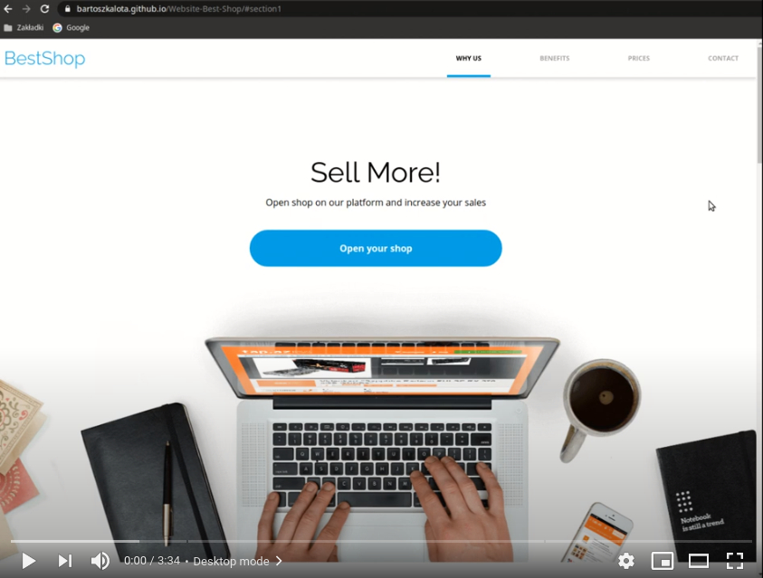

# Website 'Best Shop' (Workshop-1 & 3)
A responsive one-page website (built with i.a.: JS (ES5), SCSS, RWD) as the part of the Coders Lab course.

# Live demo
https://bartoszkalota.github.io/Website-Best-Shop/

# Video demo

# Features
* Pricing calculator
* Responsive Web Design (RWD) modes:
    * mobile (< 780px)
    * tablet (780-999px)
    * desktop (>= 1000px)
* Smooth scrolling and animations
* Movable menu underline

# Information
* This website uses JavaScript in ES5 standard. The ES6 standard is utilized in projects including at least Workshop-4 in their titles.
* It is the result of two programming workshops during the Coders Lab course:
    * Workshop-1 (HTML and CSS)
    * Workshop-3 (Gulp, SCSS, and RWD)

# Technologies
* JS (ES5)
* SCSS, RWD
* Gulp
* HTML, CSS
* Fonts:
    * OpenSans
    * Raleway